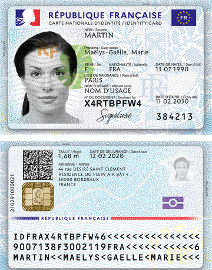
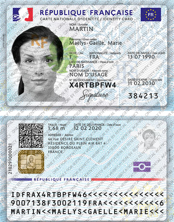

# Watermark CLI

A command-line tool for adding watermarks to images and PDFs with support for batch processing and various watermark patterns.
--

## Features

- Apply text watermarks to images in various patterns (diagonal, horizontal, vertical, random, cross-diagonal)
- Process single images/pdf or recursively process directories (pdf output isn't available for batch processing)
- Convert watermarked images to PDF format
- Parallel processing for batch operations using Rayon
- Customizable watermark spacing and JPEG compression quality

## Installation

### Prerequisites

- Rust and Cargo installed on your system

### Building from source

``` bash
git clone https://github.com/chianti-ga/watermark-cli.git
cd watermark-cli
cargo build --release
```

## Usage

``` bash
watermark-cli <INPUT_PATH> <WATERMARK> [OPTIONS]
```

### Arguments

- `<INPUT_PATH>` - Path to the input image file or directory
- `<WATERMARK>` - Text to use as watermark

### Options

- `-c, --compression <COMPRESSION>` - JPEG quality (1-100) [default: 90]
- `-s, --space-scale <SPACE_SCALE>` - Vertical spacing between watermarks [default: 1.5]
- `-r, --recursive` - Recursively apply watermark to all images in the specified directory
- `-p, --pdf` - Create PDF of watermarked image(s) instead of an image
- `-p, --pattern <PATTERN>` - Pattern of
  watermark [default: diagonal] [possible values: diagonal, horizontal, vertical, random, cross-diagonal] (NOT
  IMPLEMENTED AT THE MOMENT)
- `-h, --help` - Print help
- `-V, --version` - Print version

## Examples

Apply a diagonal watermark to a single image:

``` bash
watermark-cli sample.png "ONLY FOR IDENTITY VERIFICATION BY RENTAL AGENCY"
```

| Original file                         | Watermarked file                                   |
|---------------------------------------|----------------------------------------------------|
|  |  |

Process all images in a directory recursively with a custom pattern:

``` bash
watermark-cli --recursive --pattern horizontal path/to/directory/ "Confidential"
```

Create a PDF with watermarked images:

``` bash
watermark-cli --pdf path/to/image.jpg "DRAFT"
```

Customize watermark spacing and compression:

``` bash
watermark-cli --space-scale 2.0 --compression 80 path/to/image.jpg "SAMPLE"
```

## Supported File Formats

- JPEG/JPG
- PNG
- WebP

## TODO:

- PDF output while using recursive processing
- Custom PDF dimensions

## License

This project is licensed under the GNU General Public License v3.0 - see the LICENSE file for details.

## Font License

This project uses the Open Sans font, which is licensed under
the [SIL Open Font License, Version 1.1 ](https://openfontlicense.org/open-font-license-official-text/).
The font was designed by Steve Matteson and is available at https://fonts.google.com/specimen/Open+Sans.