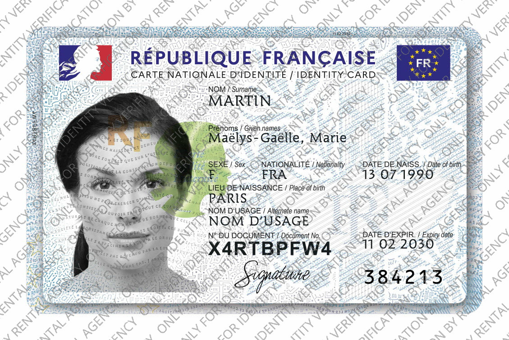

# Watermark CLI

A command-line tool for adding watermarks to images and PDFs with support for batch processing and various watermark patterns.
Designed to prevent identity theft and unauthorized copying of official documents through visible watermarking.

---

## Features

- Apply text watermarks to images in various patterns (diagonal, horizontal, vertical, random, cross-diagonal).
- Process single images or recursively process directories.
- Parallel processing for batch operations using Rayon.
- Using GPU for processing the images.
- Customizable watermark spacing and JPEG compression quality.
- Customizable watermark color and opacity.

---

## Installation

### Prerequisites

- Rust and Cargo installed on your system

### Install from crates.io

```bash
cargo install watermark-cli
```

### Building from source

```bash
git clone https://github.com/chianti-ga/watermark-cli.git
cd watermark-cli
cargo build --release
```

## Usage

```bash
watermark-cli [OPTIONS] <INPUT_PATH>
```

### Arguments

- `<INPUT_PATH>` - Path to the input image/pdf file or directory

### Options

- `-o, --output-path <OUTPUT_PATH>` - Output directory
- `-w, --watermark <WATERMARK>` - Watermark text [default: WATERMARK]
- `-q, --compression <COMPRESSION>` - Image quality 1–100 [default: 85]
- `-t, --text-scale <TEXT_SCALE>` - Watermark text scale [default: 0.05]
- `-s, --space-scale <SPACE_SCALE>` - Vertical spacing between watermarks [default: 1.5]
- `-c, --color <COLOR>` - Watermark text color in hex (e.g., FF0000 for red) [default: 808080]
- `-a, --opacity <OPACITY>` - Watermark opacity (0-255) [default: 150]
- `-p, --pattern <PATTERN>` - Pattern of watermark [default: diagonal][possible values: diagonal, horizontal, vertical, cross-diagonal, random]
- `-r, --recursive` - Recursively apply watermark to all images in the specified directory
- `-g, --gpu <GPU>` - Force GPU usage [default: auto][possible values: auto, on, off]
- `-k, --threads <THREADS>` - Max CPU worker threads (Rayon). Default - when --gpu on = 1
- `-h, --help` - Print help (see more with '--help')
- `-V, --version` - Print version

## Examples

Apply a diagonal watermark to a single image:

```bash
watermark-cli --watermark "ONLY FOR IDENTITY VERIFICATION BY RENTAL AGENCY" sample.png
```

| Original file                         | Watermarked file                                   |
| ------------------------------------- | -------------------------------------------------- |
|  |  |

- Image from ANTS/France Titres (https://ants.gouv.fr/)

Customize watermark color and opacity:

```bash
watermark-cli --watermark "SAMPLE" --color FF0000 --opacity 200 path/to/image.jpg
```

Process all images in a directory recursively with a custom pattern:

```bash
watermark-cli --watermark "Confidential" --recursive --pattern horizontal path/to/directory/
```

Customize watermark spacing and compression:

```bash
watermark-cli --watermark "SAMPLE" --space-scale 2.0 --compression 80 path/to/image.jpg
```

## Supported File Formats

- JPEG/JPG (Works)
- PNG (Testing)
- WebP (Testing)
- PDF (Testing)

## GPU Intigration

- Gives better speed on `--gpu off` but CPU usage goes 100%.
- Works best with `--gpu on/auto` and `--threads 2/3`.

## License

This project is licensed under the GNU General Public License v3.0 - see the LICENSE file for details.

## Font License

This project uses the Open Sans font, which is licensed under
the [SIL Open Font License, Version 1.1 ](https://openfontlicense.org/open-font-license-official-text/).
The font was designed by Steve Matteson and is available at https://fonts.google.com/specimen/Open+Sans.
